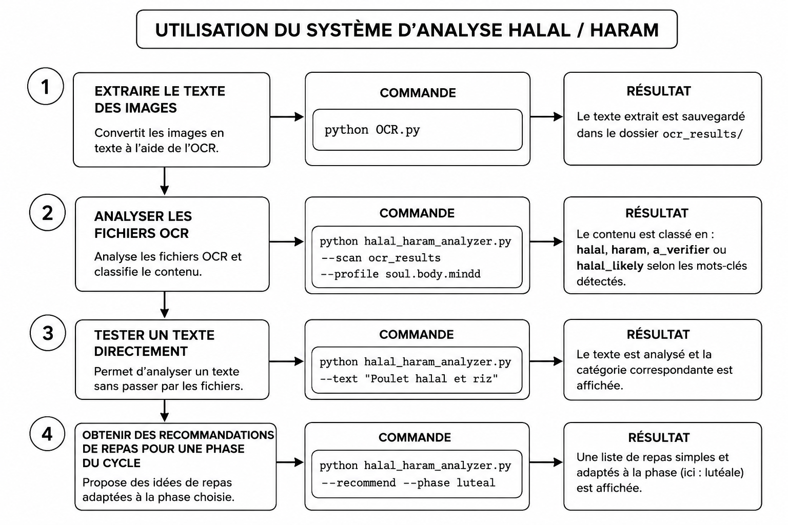

````markdown
# CycleSync Halal — RAG-Based Nutrition Assistant for Cycle Syncing with Cultural Constraint Adaptation

<p align="center">
  
</p>

<p align="center">
  <strong>An intelligent nutrition assistant combining menstrual cycle phases with cultural and religious dietary constraints</strong><br/>
  Instagram Scraping → Multilingual OCR → Halal/Haram Analysis → Personalized Recommendations
</p>

---

## 📑 Table of Contents

- [About the Project](#about-the-project)
- [Architecture Overview](#architecture-overview)
- [Key Features](#key-features)
- [Project Structure](#project-structure)
- [Installation](#installation)
- [Usage](#usage)
- [Analyzed Instagram Accounts](#analyzed-instagram-accounts)
- [Security](#security)
- [Disclaimer](#disclaimer)
- [License](#license)
- [Author](#author)

---

## About the Project

**CycleSync Halal** is a prototype of a nutrition assistant based on **Retrieval-Augmented Generation (RAG)**, designed to provide food recommendations according to the **menstrual cycle phase** while considering **cultural and religious dietary constraints (Halal/Haram)**.

### Problem Statement

Women looking to adapt their nutrition to their menstrual cycle may need resources that consider both:

- Nutritional needs associated with each menstrual cycle phase
- Cultural and religious dietary restrictions such as Halal and Haram

### Solution

The project implements an automated pipeline that:

1. **Scrapes** Instagram posts from selected wellness accounts using **Apify**
2. **Extracts text** from recipe and food images using **EasyOCR**
3. Supports multilingual text extraction, including **English, French, and Arabic**
4. **Analyzes ingredients** using a Halal/Haram knowledge base
5. **Classifies ingredients** into different compatibility categories
6. **Generates meal recommendations** according to the menstrual cycle phase
7. Filters recommendations according to cultural and religious constraints

---

## Architecture Overview

```text
┌─────────────────────┐     ┌──────────────────┐     ┌─────────────────────┐
│    scraper.py       │     │      OCR.py      │     │ halal_haram_        │
│                     │────▶│                  │────▶│ analyzer.py         │
│ Apify Instagram     │     │ EasyOCR          │     │                     │
│ Scraper             │     │ EN + FR + AR     │     │ • Classification    │
│                     │     │                  │     │   Halal/Haram       │
│ • soul.body.mindd   │     │ • Text extraction│     │ • Meal suggestions  │
│ • manskis_wellness  │     │ • Post grouping  │     │ • Cycle phases      │
└─────────────────────┘     └──────────────────┘     └─────────────────────┘
          │                          │                         │
          ▼                          ▼                         ▼
   Scraped images              OCR results              Analysis results
   + captions                  (.txt files)             + recommendations
````

### Workflow

```text
Instagram Posts
       │
       ▼
   Apify Scraper
       │
       ▼
Images + Captions
       │
       ▼
    EasyOCR
       │
       ▼
Extracted Text
       │
       ▼
Ingredient Extraction
       │
       ▼
Halal/Haram Classification
       │
       ▼
Cycle Phase Analysis
       │
       ▼
Personalized Recommendations
```

---

## Key Features

| Feature                             | Description                                                |
| ----------------------------------- | ---------------------------------------------------------- |
| 📸 **Instagram Scraping**           | Automatic retrieval of posts using Apify                   |
| 🔤 **Multilingual OCR**             | Text extraction from images using EasyOCR                  |
| 🌍 **Multilingual Support**         | English, French and Arabic text processing                 |
| ✅ **Halal/Haram Classification**    | Ingredient classification using a dedicated knowledge base |
| 🍽️ **Cycle-Based Recommendations** | Meal recommendations according to menstrual cycle phases   |
| 📂 **Automatic Organization**       | OCR results organized by profile and post                  |
| 🔒 **API Security**                 | API token handled through environment variables            |

### Ingredient Classification

| Category       | Description                                                            |
| -------------- | ---------------------------------------------------------------------- |
| `halal`        | Ingredients identified as halal                                        |
| `haram`        | Ingredients identified as prohibited                                   |
| `a_verifier`   | Ingredients requiring additional verification                          |
| `halal_likely` | No prohibited ingredient detected, but classification remains cautious |

---

## Project Structure

```text
-RAG-Based-Nutrition-Assistant-for-Cycle-Syncing-with-Cultural-Constraint-Adaptation/
│
├── scraper.py
├── OCR.py
├── halal_haram_analyzer.py
├── remplacer_par_suggestion.py
├── separer_ingredients.py
├── transformationJSON.py
├── ocr_data.json
├── requirement.txt
│
├── README.md
├── README_project.md
├── README_halal_haram.md
│
├── soul.body.mindd/
├── manskis_wellness/
│
├── ocr_results/
│   ├── soul.body.mindd/
│   │   ├── post_1_description_1.txt
│   │   └── ...
│   │
│   └── manskis_wellness/
│       └── ...
│
└── image.png
```

---

## Installation

### Prerequisites

* Python **3.9+**
* An **Apify API token**

### Clone the Repository

```bash
git clone https://github.com/maj-bakh/-RAG-Based-Nutrition-Assistant-for-Cycle-Syncing-with-Cultural-Constraint-Adaptation.git

cd -RAG-Based-Nutrition-Assistant-for-Cycle-Syncing-with-Cultural-Constraint-Adaptation
```

### Install Dependencies

```bash
pip install -r requirement.txt
```

Or install the main dependencies manually:

```bash
pip install apify-client requests easyocr pillow
```

---

## Configure the Apify Token

### Linux / macOS

```bash
export APIFY_TOKEN="your_apify_token"
```

### Windows CMD

```bash
set APIFY_TOKEN=your_apify_token
```

### Windows PowerShell

```bash
$env:APIFY_TOKEN="your_apify_token"
```

> ⚠️ Never commit your API token directly to the repository.

---

## Usage

### 1. Scrape Instagram Posts

```bash
python scraper.py
```

The scraper retrieves the configured Instagram posts and saves the corresponding images and captions.

### 2. Extract Text Using OCR

```bash
python OCR.py
```

OCR results are stored in the `ocr_results/` directory.

### 3. Analyze Ingredients

Analyze OCR results for a specific profile:

```bash
python halal_haram_analyzer.py --scan ocr_results --profile soul.body.mindd
```

Analyze text directly:

```bash
python halal_haram_analyzer.py --text "Poulet halal, riz, épinards et huile d'olive"
```

### 4. Generate Recommendations

```bash
python halal_haram_analyzer.py --recommend --phase luteal
```

### Supported Cycle Phases

| Argument             | Phase      | Main Nutritional Focus           |
| -------------------- | ---------- | -------------------------------- |
| `--phase menstrual`  | Menstrual  | Iron, magnesium                  |
| `--phase follicular` | Follicular | Light proteins, energy           |
| `--phase ovulatory`  | Ovulatory  | Antioxidants, omega-3            |
| `--phase luteal`     | Luteal     | Complex carbohydrates, fiber, B6 |

---

## Analyzed Instagram Accounts

The scraper is configured to analyze the following accounts:

| Account              | Platform  | Focus                            |
| -------------------- | --------- | -------------------------------- |
| **soul.body.mindd**  | Instagram | Holistic wellness & nutrition    |
| **manskis_wellness** | Instagram | Women's wellness & cycle syncing |

The scraper retrieves the configured recent posts from each account during execution.

---

## Security

### API Key Protection

The `APIFY_TOKEN` must be stored securely as an environment variable.

Recommended practices:

* Never hard-code API tokens in source files
* Never commit API tokens to GitHub
* Use a `.env` file locally when appropriate
* Add `.env` to `.gitignore`

Example:

```bash
echo "APIFY_TOKEN=your_token" > .env
echo ".env" >> .gitignore
```

---

## Disclaimer

> ⚠️ **This project is a research and experimental prototype.**

* The Halal/Haram classification is based on a simplified knowledge base and should not be considered a definitive religious ruling.
* The nutritional recommendations are informational and do not replace professional nutritional or medical advice.
* Users should consult qualified professionals for health-related or religious decisions.

---

## License

This project is distributed under the **MIT License**.

See the [`LICENSE`](LICENSE) file for more information.

---

## Author

**Majda BAKHARI**

GitHub: [@maj-bakh](https://github.com/maj-bakh)

```
```
